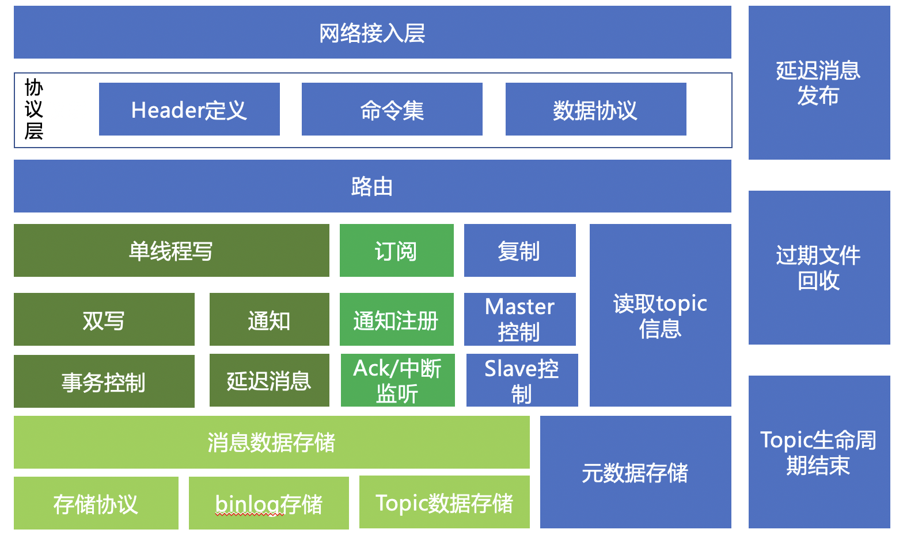
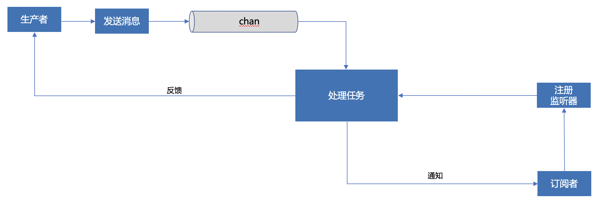

smss(small message send system),一个小型的消息队列。

# 概览

它是一个小型的消息队列，它占用的资源很少，运维简单，但处理的消息的总量、性能与其他的大型mq相比会差很多，比如kafka、rocketMQ，因此，它只能被应用非大型的业务场景中，适合创业初期，业务量不大，且机器资源有限的场景。但它也具备自己的特点：
* 占用资源非常少，在消息量少的情况下，比如qps几千，仅仅需要几十m，最多不到100m内存
* 持久化，对于某些B端业务，持久化是个强需求
* topic支持生命周期，某些场景需要一些临时的topic，频繁的删除topic会让业务代码变得更复杂，创建topic时给一个生命周期，生命周期结束后资源自动回收
* 主从复制，提供了类似mysql的主从复制，保证ha
* 还算不错的性能，单机测试，256线程，每线程10万请求，每请求200字节，qps可以达到10+万(ubuntu, 16G,20核测试)

# 部署

smss的部署非常简单，编译后只有一个可执行文件，再配以一个配置文件即可。一般部署目录如下：

* config, 该目录下是config.yaml, 描述各种配置参数
* data， 数据存储目录
* smss， 服务程序

## 配置文件——config.yaml

| 配置项                            | 描述                                                                         | 
|:-------------------------------|:---------------------------------------------------------------------------|
| port                           | 服务器端口                                                                      |
| log.path                       | log文件的输出路径，可以是绝对路径，也可以是相对路径，还可以是 stdout, stdout表示输出到控制台上                   |
| log.sample                     | 发布消息、管理topic命令的日志输出的采样率，每隔多少条输出一次日志，>=0, ==0表示不输出日志，== 1，每条都输出             |
| log.withGid                    | 输出日志时,是否输出当前goroutine id                                                   |
| log.rotate.maxSize             | 日志文件滚动，日志文件的最大值，单位M                                                        |
| log.rotate.maxBackups          | 日志文件留存的个数                                                                  |
| log.rotate.maxAge              | 日志文件保存时长，单位天                                                               |
| store.path                     | 消息数据的存储路径，一般设置为data，即在当前目录下的data子目录中存储数据                                   |
| store.maxLogSize               | 每个数据存储文件的大小，一般设置为1G,用字节数表示                                                 |
| store.flushLevel               | 数据刷盘级别，0-不刷盘，使用os cache，1-每秒刷一次盘，2-每次都刷盘(不要使用，很慢)                          |
| store.maxDays                  | 数据文件存活的最大天数，超过这个天数，文件会被删除                                                  |
| store.clearInterval            | 数据回收线程的扫描间隔，即每隔这么久时间唤醒扫描一次，单位是s                                            |
| store.waitDelLockTimeoutMs     | 回收数据文件时，需要获取该文件的保护锁，这个配置表示等待锁的时间，单位ms，一般不需要改动                              |
| store.noCache                  | 不使用os pagecache，如果true，会调用posixFadvise，建议os不要使用pagecache                   |
| worker.buffSize                | smss采用单线程持久化数据，该单线程称之为worker， buffSize即等待worker处理的任务的个数，一般不需要改动            |
| worker.waitMsgTimeout          | worker等待新的命令的超时时长，单位ms，超过该时长，worker也会唤醒，唤醒后会打印日志                           |
| worker.waitMsgTimeoutLogSample | worker等待新命令超时后日志打印输出的采样率,连续超时唤醒 waitMsgTimeoutLogSample次后，打印一条日志           |
| timeout.net.write              | smss向client端输出时的超时，单位ms                                                    |
| time.server.alive              | 在client订阅消息时，当一直没有消息时会给订阅端发送server还活着的消息，当超过time.server.alive这么久没消息时会发送    |
| background.life.defaultScanSec | 扫描有生命周期的topic的线程在无任何有生命周期的topic的情况下，也需要被唤醒，defaultScanSec指明这个唤醒间隔，单位是s     |
| background.delay.firstExec     | 延迟消息也需要一个线程，按时唤醒， firstExec指明smss启动后第一次被唤醒的时机，即启动firstExec后，执行一次延迟消息扫描，单位s |

## master部署

``
  ./smss -role master
``

role,表示以什么角色来启动实例，角色包括master和slave

## slave部署

``
./smss -role slave -host 127.0.0.1 -port 12301 -event 0
``

event, smss的设计里，每一个写操作（包括发布消息、创建、删除topic）都有一个eventId，eventId是唯一且递增的，根据这个eventId可以定位到哪个数据文件的哪个位置。
event参数表示slave已经复制完的事件，master需要发送下一个事件的数据，当event设置为0时，表示master需要从它的第一个文件的、第0个字节开始发送数据。

# 设计
## 总体架构


### 命令集

| 命令                 | 数值  | 说明                                                |
|:-------------------|:----|:--------|
| CommandSub         | 0   | 订阅消息  |
| CommandPub         | 1   | 发布消息|
| CommandCreateTopic | 2   | 创建topic|
| CommandDeleteTopic | 3   | 删除topic|
| CommandDelay       | 16  | 发布延迟消息|
| CommandAlive       | 17  | 连接探活，类似于mysql的ping/pong,用于判断连接是否存活|
| CommandReplica     | 64  | 复制binlog指令|
| CommandValidList   | 99  | 读取当前有效的topic，处于标记删除或者超过生命周期的topic都不展示|
| CommandList        | 100 | 读取所有的topic，包括标记删除和超过生命周期的|
| CommandDelayApply  | 101 | 延迟的消息真正发布，延迟消息到时触发后，真正把消息发布出去，内部使用，超过100的指令都是内部使用 |

### header定义
#### request header
由固定20个字节组成，有3个段是固定的，其他根据不同的cmd有所不同。  

|1 byte， cmd| 2个字节，topic名称的长度 | ...,不同的cmd，有所不同 |1个字节，traceId的长度|
|----|-----------------|-----------------|-----|

如果topic名称的长度不为0，那么header后面跟的就是topic的名字；   
如果traceId的长度不为0，那么name后面跟的就是traceId；   
再后面跟的就是每种不同的cmd要求的payload的数据。   

#### response header

由固定10个字节组成，前2个字节表示状态吗，后面根据不同的状态码有所不同。   

|状态码|数值|说明|
|---|---|---|
|OkCode|200|正确|
|ErrCode|400|出现错误，header后面跟错误信息|
|AliveCode|201|订阅场景使用，smss等待一段时间没有发现新消息进入，会给订阅端发送AliveCode，表示smss还活着|
|SubEndCode|255|订阅结束，通知订阅端，当前topic已经删除，不能再订阅，用于topic被删除或者生命周期结束被触发|

## 存储设计

smss要存储的数据包括：
* topic的元数据，比如topic的名称、创建时间、状态、生命周期等
* 消息数据，包括binlog数据，以及topic中的消息数据
* 延迟消息数据

元数据和延迟消息数据我们使用kv存储，我们选用了badger数据库存储，它是dgraph底层的存储引擎，
实现原理与rocksdb类似，采用lsm技术实现，但它是纯golang开发，可以更好的嵌入golang应用中，而按照官方说法，性能不亚于纯c的rocksdb。

而消息数据，包括binlog和topic数据采用纯文件系统存储，消息队列的存储与rdbms相比简单的多，它并不需要支持acid，对于已经存储过的
每条消息都是只读的，因此可以直接采用顺序写就可以完成任务，还保持了高效的性能。

### 元数据存储

badger是一个kv数据库，与所有的其他kv数据库相同，它是以key为主键，且按照key的顺序存储的，badger内部所有的可以都是有序存储的，排序是按照key的二进制进行的。   

利用badger的key有序性，我们可以对不同的元数据进行分组：

* topic的基础信息的key以“norm@"作为前缀，可以使用前缀扫描迅速的找出所有的topic
* 带生命周期的topic还会有一个以"lf@"作为前缀的key，其格式是 lf@ + topic失效时间戳 + topic name，利用key的有序性可以快速扫描出所有失效的topic
* 延迟消息存储，虽然延迟消息不是元数据，但我们可以使用badger存储，它的前缀是 "delay@", 其完整格式是 delay@ + 消息触发时间戳 + 产生延迟消息的eventId + topic name， 使用eventId，是为了保证key的唯一性

### 消息数据

消息数据都是以文件存储的，每个文件的名称是顺序递增的数字，每个文件的大小默认是1G，可配，当超过1G是马上开启下一个文件。

#### binlog

binlog存储在${store.path}/binlog目录下，每个文件有多个数据块组成，每个数据块由 cmd和payload数据组成，cmd中会包含后续payload数据的大小，cmd由cmd大小+cmd信息组成，为了更好的可视化，cmd以字符串的形式存在，且cmd和payload都以\n结束，
这样就可以使用文本工具来浏览数据。

#### topic

为避免所有的topic落在一个目录下，每个topic是一个三级目录，一、二级目录个100个（总共10000），目录名是0-99，topic名称作为三级目录，多个1G大小的文件用于存储消息，
每个topic会按照名字和不同的salt产出hash值，均匀的散落在一、二级目录下。topic的消息数据格式与binlog类似，也是可视的。

#### 双写及事务

smss设计为双写，binlog和topic数据各写一份，这点类似mysql，但与rocketmq不同，rocketmq的topic不存储具体数据仅仅存消息在commitlog中的索引，这样可以减小io和磁盘占用，但订阅消息时需要使用fseek在commitlog中不断跳跃（没有具体细究，可能会理解错误），smss希望避免跳跃，
且职责分离，binlog用于复制和smss崩溃后恢复，topic用于客户端订阅，由于smss定位是小场景，数据不会多，这么设计会非常简单。   

双写自然就会涉及事务，smss采用3个手段来避免数据不一致：

* 单线程写
* 数据先在内存内处理好，然后一次性写入文件，先写binlog，后写topic，topic写失败后，使用Truncate回滚binlog
* topic文件中记录binlog文件id、文件中位置以及eventId，当smss崩溃重启后，检查最后一个binlog文件的最后一个数据块，与topic或者元数据比对，如果不能对齐则回滚binlog

## 多线程写控制

smss会并发的从多个producer接收指令，这些指令可能是发布消息、发布延迟消息、创建topic、删除topic等，这些指令需要并发写数据，这些数据可能是
要写到元数据库，或者写到topic中，并发控制是个难题。smss并没有在并发上花功夫，而是利用channel把多线程写转化为单线程写，从而避免了复杂的并发控制。   



### 通知订阅

在smss写消息时，可能多个订阅者正在等待新的消息，这需要写线程写完消息后及时通知多个订阅端来读取消息。   
当topic需要被删除时，也是发删除消息给写线程，写线程先标记删除topic后，通知订阅者不能再订阅，然后再物理删除topic。

## 订阅

smss客户端可以发送订阅指令来定义消息，订阅指令包含两个信息：消息的名称、eventId。    
eventId的语义是当前客户端已经消费的最后一个消息的eventId，smss会推送该eventId之后的新消息，注意这个语义，不要发送eventId+1给smss，smss
接到订阅指令后会在检查这个eventId，如果这个eventId不存在，会报错，eventId在smss内部是全局递增的，eventId+1可能是另一个topic小的eventId，也可能是创建topic指令。

客户端可以批量订阅消息，即每次smss推送多条消息给订阅端，这个可以在订阅时指定，同时也可以指定客户端处理消息的最长时间，smss在这个最长时间内不能获取客户端返回的ack，即认为客户端已经死掉，它会关闭连接，释放资源。

## 分组订阅
smss支持多次消费topic中的消息，多个订阅者可以同时消费topic的相同或者不同的消息，这比较灵活，但有的服务由于ha的原因需要部署多个实例，但多个实例需要只有一个实例能消费topic的消息，类似kafka的group
功能，smss的订阅者需要自行指定当前订阅者的名称，类似于kafka的分组名称，不同名称的订阅者之间可以并行，但相同的订阅者只能有1个实例能够消费。
* smss的客户端并没有提供一个分布式锁来保证相同名称的订阅者之间的互斥，这需要开发者自行实现，比如是zookeeper或者redis来实现分布式锁
* smss服务端提供了兜底方案，如果已经存在一个订阅者，后续的相同名称的订阅者将被拒绝

```
    func NewSubClient(mqName, who, host string, port int, timeout time.Duration) (*SubClient, error)
```

参数 who即当前订阅者的名称

### redis分布式锁
订阅消息是一个长时间的过程，在订阅过程中可能随时中断，那么另一个实例需要能够马上获取到锁，然后开始订阅，但redis并没有提供像zookeeper那样的分布式锁。使用redis 的setnx + 超时+定时续约的方式
可以模拟长时间锁。
* 使用uuid生成当前订阅id
* 使用setnx who id expire 获取锁，expire 是一个较小的时间，比如30s

```
func acquireLock(client *redis.Client, who string, subId string, expiration time.Duration) bool {
    return client.SetNX(context.Background(), who, subId, expiration).Val()
}
```

* 以短于30s的周期定时续约，比如25s，为了保持原子性，使用lua

```
  const luaExtendScript = `
      if redis.call("get", KEYS[1]) == ARGV[1] then
          return redis.call("expire", KEYS[1], ARGV[2])
      else
          return 0
      end
  `
  func extendLock(client *redis.Client, who string, subId string, expiration int) bool {
      cmd := client.Eval(context.Background(), luaExtendScript, []string{who}, subId, expiration)
      return cmd.Val().(int64) == 1
  }
```
* 使用完锁后，删除 who以释放锁
* 另一个实例，定时长时获取锁，比如20s

## 复制

复制跟订阅类似，只是复制是从binlog读取文件，订阅是从topic读取文件，在smss底层，二者共用standard代码。   
slave向master发起复制指令，master会根据eventId定位binlog文件的位置，并向写线程注册新数据通知，master的复制线程会不断地向slave推送数据块，
复制不像订阅，复制不需要ack，这点与mysql主从复制类似。slave接收到数据块后直接向写线程发送指令，写线程持久化数据后通知slave复制线程，slave复制线程继续从
socket读取新的数据块，由于master即使在没有新数据的情况下也会每个30s发送alive消息，所以slave复制线程在超过30s没有读取到数据后就会认为复制连接已死，它会关闭连接
并sleep一段时间后继续尝试复制。   

与mysql不同的是，smss slave没有启用两个线程完成复制，mysql会先存储binlog，另外一个线程在从binlog读取数据写回到数据，smss简化了复制流程，读取数据后直接写库，写库流程
也复用了master的写流程，但复制毕竟与master的写不同，smss在发送复制消息时会给消息打标，表示该消息是复制消息，写线程会根据复制场景做一些兼容，比如，topic不存在会跳过，而不会报错。

# 客户端

## sdk

* [golang版本](https://github.com/rolandhe/smss-client)
* [java版本](https://github.com/rolandhe/smss-client-java)

### 说明
* 订阅客户端
* 发送或其他管理客户端
  * 简单客户端，底层使用短链接，使用完成后关闭连接，非生产环境可以使用
  * 连接池，连接使用完后可重用，生产环境中要使用连接池

具体的使用示例请参见具体的客户端sdk。

## 命令行工具

https://github.com/rolandhe/smss-client/tree/main/test/command 下是命令行工具的代码，可以执行相应的shell来生成可执行程序。
